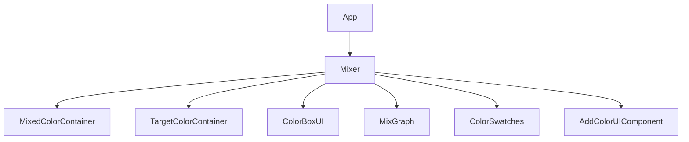
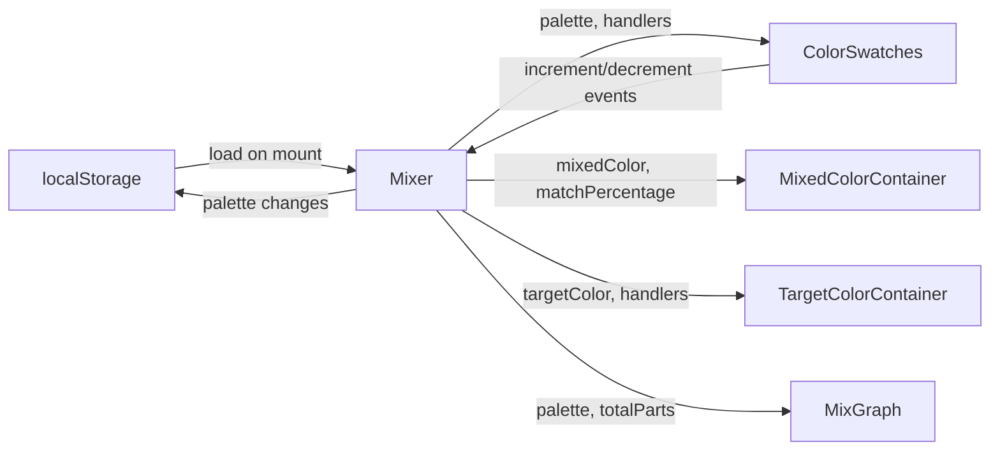

# Architecture

## Overview

Paint Mixer is a client-side React SPA with no backend. All state is managed in the browser; the palette persists via localStorage. There is no server, no API, and no user accounts.

**Stack:**
- React 18 + TypeScript
- Webpack (bundler + dev server)
- Sass + Tailwind CSS
- Deployed on Netlify (static site)

**Key libraries:**
- `mixbox` — Kubelka-Munk pigment mixing model (the core of the mixing engine)
- `tinycolor2` — color parsing, conversion, and manipulation
- `@uiw/color-convert`, `@uiw/react-color-wheel` etc. — color picker UI components
- `color-name-list` — human-readable color names by hex value

**Data submodule:**
- `paint-crawl/` — git submodule (`beekman/paint-crawl`); ~53K real paint colors across 21 mediums
- JSON files are copied to `dist/paint-data/` at build time via `CopyWebpackPlugin`
- Fetched at runtime per medium; never bundled into the main JS chunk

## Component Tree

```
App
└── Mixer  (orchestrator — owns all state)
    ├── MixedColorContainer   (displays current mix result)
    ├── TargetColorContainer  (displays target color + picker)
    ├── ColorBoxUI            (Save / Reset / Target controls)
    ├── MixGraph              (visual breakdown of mix proportions)
    ├── ColorSwatches         (palette display + increment/decrement)
    └── AddColorUIComponent   (tabbed panel to add new paint to palette)
        ├── ColorPicker tab   (color wheel — existing)
        └── PaintLibrary tab  (browse paint-crawl data by medium/brand/name)
```



## Data Flow

`Mixer` is the single source of truth. It owns all state and passes data and handlers down as props. There is no global state manager (no Redux, no Context API for app state).



## Custom Hooks (in `src/data/hooks/`)

| Hook | Purpose |
|------|---------|
| `usePaletteManager` | CRUD operations on the palette array |
| `useColorMatching` | deltaE94 color difference → named color lookup |
| `useLocalStorage` | Persist/load palette to localStorage |
| `useSwatchAdder` | Handles the add-to-palette flow |
| `useColorName` | Resolves a human-readable name for any color |
| `useColorSolver` | Manages Web Worker lifecycle for the color solver |
| `usePaintLibrary` | Fetches and filters paint-crawl medium data |

## Utilities (in `src/utils/`)

| Utility | Purpose |
|---------|---------|
| `colorConversion.tsx` | RGB ↔ XYZ ↔ Lab conversions, deltaE94 |
| `isDark.ts` | Determines if a color is dark (drives dynamic contrast) |
| `palettes/defaultPalette.tsx` | Starting palette of artist paint colors |
| `palettes/cmykPalette.tsx` | CMYK-based palette option |

## Dynamic Color System

The `isDark` utility is a cross-cutting concern. Any UI element that renders on top of a variable color background (swatches, labels, controls) uses it to choose between light and dark text/icons. **This must be preserved whenever color rendering is changed.**

## Known Optimization Opportunities

The codebase has not been profiled. Areas likely worth reviewing:
- Re-render frequency in `Mixer` (many `useEffect` hooks trigger on palette changes)
- Color conversion chains (multiple library calls per render cycle)
- Mixbox latent-space math runs on every palette change
