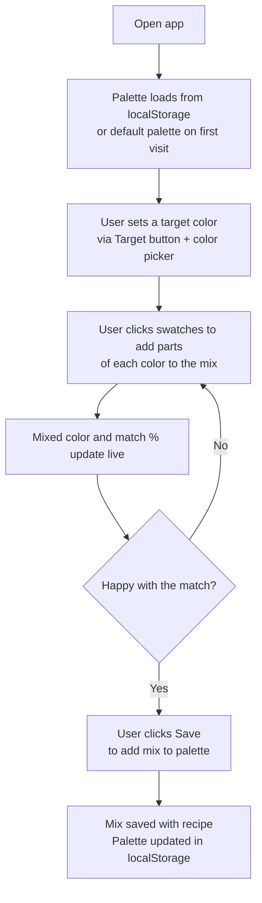
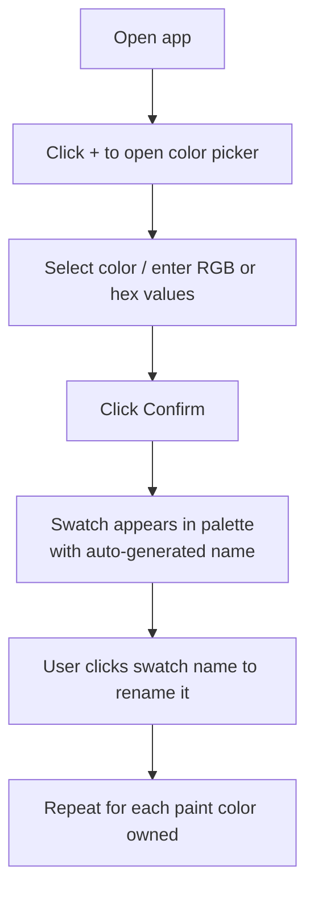
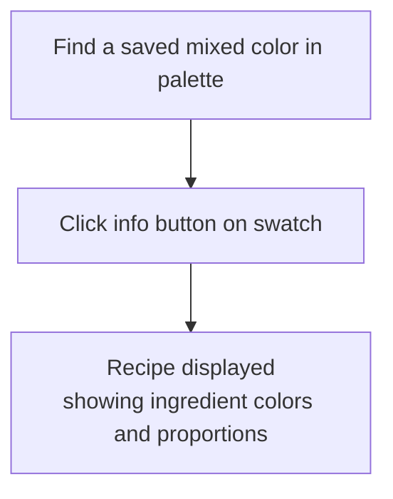
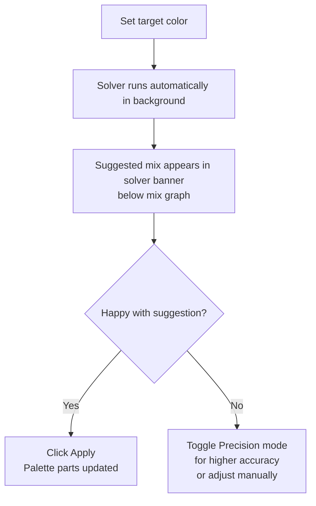
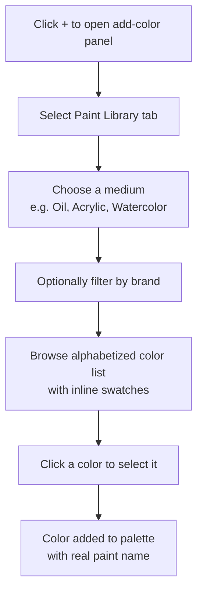

# User Journeys

## Primary Journey: Mix to Match a Target

A painter wants to reproduce a specific color using paints they already own.

## Secondary Journey: Catalog Paints

A painter sets up their palette before mixing.

## Tertiary Journey: Review a Recipe

A painter wants to recall how they mixed a saved color.

## Journey: Color Solver

A painter wants the app to suggest the best mix automatically.

## Journey: Browse Paint Library

A painter wants to add a specific real-world paint color to their palette.

